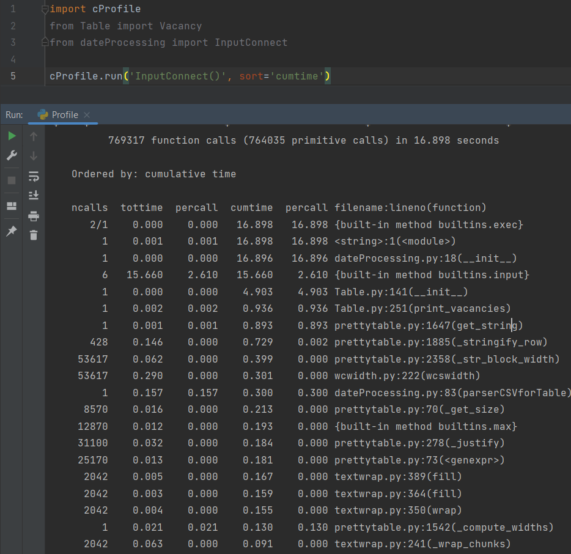

# Коссе Иван

## Задание 2.3.2 Тестирование:

- Отчёт о тестировании на doctest

- Отчёт о тестировании на unittest

## Задание 2.3.3 Профилирование:
### Без многопроцессорной обработки
- При печати вакансий

- При генерации отчёта (Здесь профилирование было с файлом vacancies_medium)

- При форматировании даты: 

Функция formatterDataDatetime

Функция formatterDataStr

Функция formatterDataRe (переименована)

## Задание 3.2.1 Разделить данные

